<!-- Animated profile hero -->

<picture>
  <source
    media="(prefers-color-scheme: dark)"
    srcset="./images/dark.svg?v=3"
  />
  <source
    media="(prefers-color-scheme: light)"
    srcset="./images/light.svg?v=2"
  />
  
</picture>

<p align="center">
  <a href="https://tus-portfolio.vercel.app/"><strong>Portfolio</strong></a>
  &nbsp;·&nbsp;
  <a href="https://www.linkedin.com/in/t%C3%BA-phan-203970327/"><strong>LinkedIn</strong></a>
  &nbsp;·&nbsp;
  <a href="mailto:mudotet@gmail.com"><strong>Email</strong></a>
</p>

<p align="center">
  <sub>Hanoi, Vietnam · Open to Java Backend Intern and Fresher roles</sub>
</p>

<br/>

## Backend first. Product aware.

I'm Tú, a final-year IT Engineering student who builds backend systems and AI-assisted products.

Most of my work sits where APIs, authentication, persistence, caching, and external services meet. I care about clear boundaries, predictable failure modes, and software that solves a real user problem—not complexity for its own sake.

```text
NOW       Spring Boot services · AI-enabled workflows
DEPTH     API design · security · persistence · caching · testing
NEXT      scalable systems · software architecture · technical communication
OPEN TO   Java Backend Intern · Java Backend Fresher · backend-focused full stack
```

## Selected work

### 01 / NYALA — real-estate auction platform

<sub>PathTech JSC internship · NestJS · PostgreSQL · Redis · Stripe</sub>

Contributed to REST APIs, JWT and role-based authorization, payment flows, webhooks, and cache-backed application features in a team environment.

[Read the project overview →](https://tus-portfolio.vercel.app/)

### 02 / Identity Service

<sub>Java · Spring Boot · Spring Security · JPA · MySQL</sub>

Built an authentication and authorization service around JWT, RBAC, persistence, and explicit DTO mapping.

[View source →](https://github.com/mudotet/identity_services)

### 03 / Invoice Extraction

<sub>Python · PyTesseract · LayoutLM · PyTorch · Streamlit</sub>

Built a document-processing pipeline that turns invoice images into structured data with JSON and CSV export.

[View source →](https://github.com/mudotet/Invoice_Extraction_Project)

### 04 / AI Emotion App

<sub>Java · JavaFX · MySQL · AI model integration</sub>

Built a desktop application that combines AI conversations with emotion classification, mood history, and persistent conversation data.

[View source →](https://github.com/mudotet/AI_EMOTION_APP)

## Technical profile

<p align="center">
  <picture>
    <source
      media="(prefers-color-scheme: dark)"
      srcset="https://skillicons.dev/icons?i=java,spring,nestjs,python,fastapi,postgres,mysql,mongodb,redis,docker,maven,git,github,postman,react,js&amp;perline=8&amp;theme=dark"
    />
    <source
      media="(prefers-color-scheme: light)"
      srcset="https://skillicons.dev/icons?i=java,spring,nestjs,python,fastapi,postgres,mysql,mongodb,redis,docker,maven,git,github,postman,react,js&amp;perline=8&amp;theme=light"
    />
    
  </picture>
</p>

## How I approach backend work

```text
User problem
     │
     ▼
API contract ──► validation & security
     │
     ▼
Domain logic ──► database / cache / external service
     │
     ▼
Tests & failure handling
     │
     ▼
Observe, debug, improve
```

The target is software that is understandable, secure, testable, maintainable, and useful.

## A good fit

I'm looking for a team where I can contribute to real backend features, learn through direct code review, and grow into an engineer trusted with production systems.

If that sounds aligned, reach me at [mudotet@gmail.com](mailto:mudotet@gmail.com), connect on [LinkedIn](https://www.linkedin.com/in/t%C3%BA-phan-203970327/), or explore the longer case studies on my [portfolio](https://tus-portfolio.vercel.app/).

---

## Contribution signal

<picture>
  <source
    media="(prefers-color-scheme: dark)"
    srcset="./images/contribution-dark.svg"
  />
  <source
    media="(prefers-color-scheme: light)"
    srcset="./images/contribution-light.svg"
  />
  
</picture>

---

## Contribution Breakout
<picture>
  <source
    media="(prefers-color-scheme: dark)"
    srcset="./images/breakout-dark.svg?v=1"
  />
  <source
    media="(prefers-color-scheme: light)"
    srcset="./images/breakout-light.svg?v=1"
  />
  
</picture>

<p align="center">
  <code>build → break → debug → learn → repeat</code>
</p>
